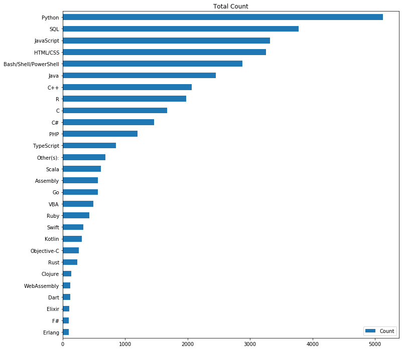

# An Analysis of the 2019 Stack Overflow Survey Data
> 
The motivation behind this project is to use CRISP-DM methodology to carryout an analysis of the 2019 Stack Overflow Developer Survery Data analysis with the aim of uncovering answers to the following crucial questions:
* What is the programming language of choice?
* What's the pay for developers like?
* What is the framework of choice for developers?

Note that this questions are asked more specifically in relation to Data Scientist and Machine Learning Specialists survey respondents.

This project is also featured on the Medium website @ [link](https://medium.com/@charlesmodingwa/2019-stack-overflow-survey-analysis-c8dac1617d40?sk=068e7825d3d5081bb4bac243a1b31878)

## Table of contents

* [Summary of results](#summary-of-results)
* [Data and Code](#data-and-code)
* [Prerequisites](#prerequisites)
* [Instructions on running the application](#instructions-on-running-the-application)

## Summary of the results
After analyzing the data, we found that python is the programming language of choice for developers who identify as Data Scintists and Machine Learning Specialists. Salaries for Data Scientists and Machine Learning Specialist are the highest in the USA. Surprisingly, jQuery is the web framework of choice.

Here are some of the results:

* 
* 

## Data and Code
* The main analysis is contained in the 2019 Stack Overflow Survey Analysis.ipynb jupyter notebook. All the functions and code, as well as the rationale behind decisions taken is contained in this notebook.

Data for the analysis is available at: [survey datasets](https://insights.stackoverflow.com/survey)
## Prerequisites
* Numpy
* Pandas
* seaborn
* Matplotlib

Jupyter notebook and python 3.6 are needed to run the notebooks and python scripts.

## Instructions on running the application
1. Download the required data sets and if required modify the directory paths.
